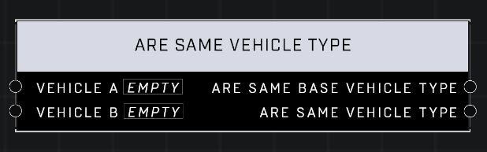

# Are Same Vehicle Type

## Description
Returns whether the two objects share a base Vehicle Type (e.g. both are Warthogs) and if they share a Vehicle Type (e.g. both are Rockethogs). Two objects with invalid Vehicle Types will compare as true.

## Node Type
Nodes fall into two basic categories: Data and Execution. This node supplies Data for an Execution node.

## Inputs
| Input | Type | Required | Description |
|------------------|------------------|----------|--------------------------------------------------------------|
| Vehicle A | Object | Yes | A vehicle to compare type to other pin. |
| Vehicle B | Object | Yes | A vehicle to compare type to other pin. |

## Outputs
| Output | Type | Description |
|------------------|------------------|--------------------------------------------------------------|
| Are Same Base Vehicle Type | Boolean | Outputs true or false if both are same base vehicle type. |
| Are Same Vehicle Type | Boolean | Outputs true or false if both are same vehicle type. See Vehicle Type page for a list of Types.|

\
\
**Contributors**

AddiCt3d 2CHa0s