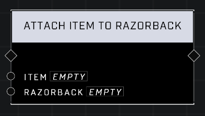

# Attach Item To Razorback

## Description
Attaches the _Item_ to a valid empty slot on the _Razorback_. Will not succeed if there are no valid empty slots for the _Item_.  

## Node Type
Nodes fall into two basic categories: Data and Execution. This node Executes a function directly in the node string.

## Inputs
| Input | Type | Required | Description |
|------------------|------------------|----------|--------------------------------------------------------------|
| Item | Object | Yes | Which object is being attached to razorback. |
| Razorback | Object | Yes | Which razorback to attach object to. |

## Outputs
| Output | Type | Description |
|------------------|------------------|--------------------------------------------------------------|
| (none) | | |

\
\
**Contributors**

AddiCt3d 2CHa0s \
Okom \
Jordan9232