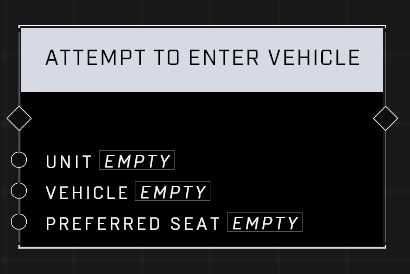

# Attempt To Enter Vehicle

## Description
Have the Player attempt to enter the vehicle regardless of distance. Will not succeed if the Vehicle has no seats available or the Player is already in a vehicle.

## Node Type
Nodes fall into two basic categories: Data and Execution. This node Executes a function directly in the node string.

## Inputs
| Input | Type | Required | Description |
|------------------|------------------|----------|--------------------------------------------------------------|
| Unit | Object | Yes | Which unit to attempt vehicle enter. |
| Vehicle | Object | Yes | Which vehicle to enter. |
| Preferred Seat | Seat | Yes | Driver, Gunner, Passenger. |

## Outputs
| Output | Type | Description |
|------------------|------------------|--------------------------------------------------------------|
| (none) | | |

\
\
**Contributors**

AddiCt3d 2CHa0s