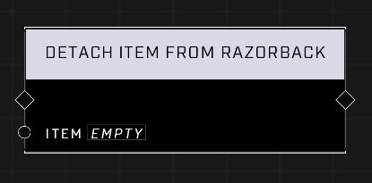

# Detach Item From Razorback

## Description
Forces the Item to detach from the Razorback it is attached to. Has no effect if the item is not attached to a Razorback.

## Node Type
Nodes fall into two basic categories: Data and Execution. This node Executes a function directly in the node string.

## Inputs
| Input | Type | Required | Description |
|------------------|------------------|----------|--------------------------------------------------------------|
| Item | Object | Yes | Which object to detach. |

## Outputs
| Output | Type | Description |
|------------------|------------------|--------------------------------------------------------------|
| (none) | | |

\
\
**Contributors**

AddiCt3d 2CHa0s