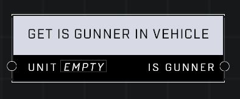

# Get Is Driving Vehicle

## Description
Returns true if the Unit is a gunner in their vehicle. Drivers who control their vehicle's weapons, like in Ghosts, are also considered to be gunners.

## Node Type
Nodes fall into two basic categories: Data and Execution. This node supplies Data for an Execution node.

## Inputs
| Input | Type | Required | Description |
|------------------|------------------|----------|--------------------------------------------------------------|
| Unit | Object | Yes | Which unit to check. |

## Outputs
| Output | Type | Description |
|------------------|------------------|--------------------------------------------------------------|
| Is Gunner | Boolean | True if unit is gunner, false if not. |

\
\
**Contributors**

AddiCt3d 2CHa0s