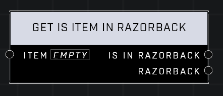

# Get Is Item In Razorback

## Description
Returns true if the Unit is seated in a vehicle

## Node Type
Nodes fall into two basic categories: Data and Execution. This node supplies Data for an Execution node.

## Inputs
| Input | Type | Required | Description |
|------------------|------------------|----------|--------------------------------------------------------------|
| Item | Object | Yes | Which item to check. |

## Outputs
| Output | Type | Description |
|------------------|------------------|--------------------------------------------------------------|
| Is In Razorback | Boolean | True if unit is in vehicle, false if not. |
| Razorback | Object | Which razorback, if any, the item is in. |

\
\
**Contributors**

AddiCt3d 2CHa0s \
Okom \
Jordan9232