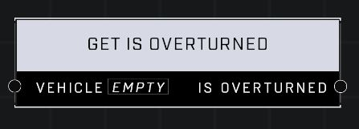

# Get Is Overturned

## Description
Returns true if the Vehicle is overturned and would need to be flipped to allow players to enter it

## Node Type
Nodes fall into two basic categories: Data and Execution. This node supplies Data for an Execution node.

## Inputs
| Input | Type | Required | Description |
|------------------|------------------|----------|--------------------------------------------------------------|
| Vehicle | Object | Yes | Which vehicle this node affects. |

## Outputs
| Output | Type | Description |
|------------------|------------------|--------------------------------------------------------------|
| Is Overturned | Boolean | True if vehicle is overturned, false if not. |

\
\
**Contributors**

AddiCt3d 2CHa0s