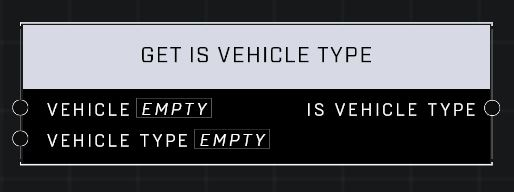

# Get Is Vehicle Type

## Description
Returns true if the Vehicle matches the Vehicle Type

## Node Type
Nodes fall into two basic categories: Data and Execution. This node supplies Data for an Execution node.

## Inputs
| Input | Type | Required | Description |
|------------------|------------------|----------|--------------------------------------------------------------|
| Vehicle | Object | Yes | Which vehicle to check type of. |
| Vehicle Type | Vehicle Type | Yes | Which type to check for. |

## Outputs
| Output | Type | Description |
|------------------|------------------|--------------------------------------------------------------|
| Is Vehicle Type | Boolean | True if vehicle matches the input Vehicle Type, false if not. See Vehicle Type page for a list of Types. |

\
\
**Contributors**

AddiCt3d 2CHa0s