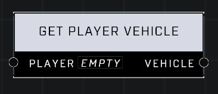

# Get Player Vehicle

## Description
Returns the parent vehicle if the Player is seated in one

## Node Type
Nodes fall into two basic categories: Data and Execution. This node supplies Data for an Execution node.

## Inputs
| Input | Type | Required | Description |
|------------------|------------------|----------|--------------------------------------------------------------|
| Player | Player | Yes | Which player to check for a vehicle. |

## Outputs
| Output | Type | Description |
|------------------|------------------|--------------------------------------------------------------|
| Vehicle | Object | Outputs a vehicle or nil if player is not seated in a vehicle. |

\
\
**Contributors**

AddiCt3d 2CHa0s