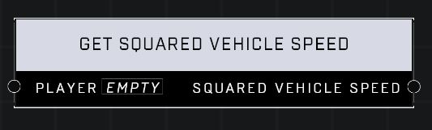

# Get Squared Vehicle Speed

## Description
Returns the squared speed in world units per second of the vehicle the Player is in. Returns 0 if the Player is not in a vehicle.

## Node Type
Nodes fall into two basic categories: Data and Execution. This node supplies Data for an Execution node.

## Inputs
| Input | Type | Required | Description |
|------------------|------------------|----------|--------------------------------------------------------------|
| Player | Player | Yes | Which player to check vehicle speed for. |

## Outputs
| Output | Type | Description |
|------------------|------------------|--------------------------------------------------------------|
| Squared Vehicle Speed | Number | Squared speed. 0 if not in a vehicle. |

\
\
**Contributors**

AddiCt3d 2CHa0s