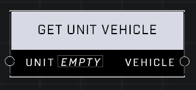

# Get Unit Vehicle

## Description
Returns the parent vehicle if the Unit is seated in one

## Node Type
Nodes fall into two basic categories: Data and Execution. This node supplies Data for an Execution node.

## Inputs
| Input | Type | Required | Description |
|------------------|------------------|----------|--------------------------------------------------------------|
| Unit | Object | Yes | Which unit to check. |

## Outputs
| Output | Type | Description |
|------------------|------------------|--------------------------------------------------------------|
| Vehicle | Object | Outputs a vehicle if unit is in one. |

\
\
**Contributors**

AddiCt3d 2CHa0s