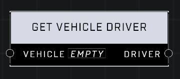

# Get Vehicle Driver

## Description
Returns the driver of the Vehicle if it has one

## Node Type
Nodes fall into two basic categories: Data and Execution. This node supplies Data for an Execution node.

## Inputs
| Input | Type | Required | Description |
|------------------|------------------|----------|--------------------------------------------------------------|
| Vehicle | Object | Yes | Which vehicle to check for a driver. |

## Outputs
| Output | Type | Description |
|------------------|------------------|--------------------------------------------------------------|
| Driver | Unit | The driver of the vehicle if it has one. |

\
\
**Contributors**

AddiCt3d 2CHa0s