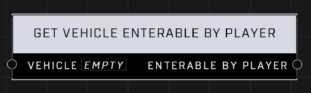

# Get Vehicle Enterable By Player

## Description
Returns true if a player may enter the Vehicle

## Node Type
Nodes fall into two basic categories: Data and Execution. This node supplies Data for an Execution node.

## Inputs
| Input | Type | Required | Description |
|------------------|------------------|----------|--------------------------------------------------------------|
| Vehicle | Object | Yes | Which vehicle to check if it's enterable. |

## Outputs
| Output | Type | Description |
|------------------|------------------|--------------------------------------------------------------|
| Enterable By Player | Boolean | True if vehicle can be entered, false if it cannot. |

\
\
**Contributors**

AddiCt3d 2CHa0s