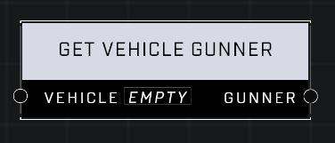

# Get Vehicle Gunner

## Description
Returns the gunner of the Vehicle if it has one

## Node Type
Nodes fall into two basic categories: Data and Execution. This node supplies Data for an Execution node.

## Inputs
| Input | Type | Required | Description |
|------------------|------------------|----------|--------------------------------------------------------------|
| Vehicle | Object | Yes | Which vehicle to check for a gunner. |

## Outputs
| Output | Type | Description |
|------------------|------------------|--------------------------------------------------------------|
| Gunner | Object | Outputs the gunner if there is one in the vehicle. |

\
\
**Contributors**

AddiCt3d 2CHa0s