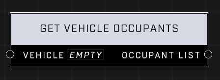

# Get Vehicle Occupants

## Description
Returns a list of all players who occupy a seat in the Vehicle

## Node Type
Nodes fall into two basic categories: Data and Execution. This node supplies Data for an Execution node.

## Inputs
| Input | Type | Required | Description |
|------------------|------------------|----------|--------------------------------------------------------------|
| Vehicle | Object | Yes | Which vehicle to check for occupants. |

## Outputs
| Output | Type | Description |
|------------------|------------------|--------------------------------------------------------------|
| Occupant List | Object List | An object list of all occupants in the vehicle. |

\
\
**Contributors**

AddiCt3d 2CHa0s