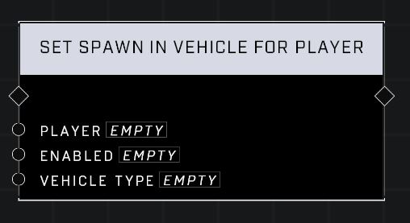

# Set Spawn In Vehicle For Player

## Description
Enables or disables whether a Player respawns in a specific type of vehicle instead of on foot. WARNING! Use with care. Too many vehicles on the map can severely affect network performance.

## Node Type
Nodes fall into two basic categories: Data and Execution. This node Executes a function directly in the node string.

## Inputs
| Input | Type | Required | Description |
|------------------|------------------|----------|--------------------------------------------------------------|
| Player | Player | Yes | Which player to set Spawn In Vehicle for. |
| Enabled | Boolean | Yes | When true this node is active. |
| Vehicle Type | Vehicle Type | Yes | What type of vehicle to spawn players in. |

## Outputs
| Output | Type | Description |
|------------------|------------------|--------------------------------------------------------------|
| (none) | | |

\
\
**Contributors**

AddiCt3d 2CHa0s