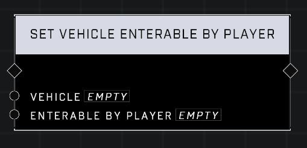

# Set Vehicle Enterable By Player

## Description
When Enterable By Player is set to false, all players will be prevented from entering the Vehicle. To prevent a specific player from driving or gunning, consider using a Trait: Vehicle Passenger Only.

## Node Type
Nodes fall into two basic categories: Data and Execution. This node Executes a function directly in the node string.

## Inputs
| Input | Type | Required | Description |
|------------------|------------------|----------|--------------------------------------------------------------|
| Vehicle | Object | Yes | Which vehicle to set enterable for. |
| Enterable By Player | Boolean | Yes | When true vehicle is enterable. Set to false to prevent players from entering. |

## Outputs
| Output | Type | Description |
|------------------|------------------|--------------------------------------------------------------|
| (none) | | |

\
\
**Contributors**

AddiCt3d 2CHa0s