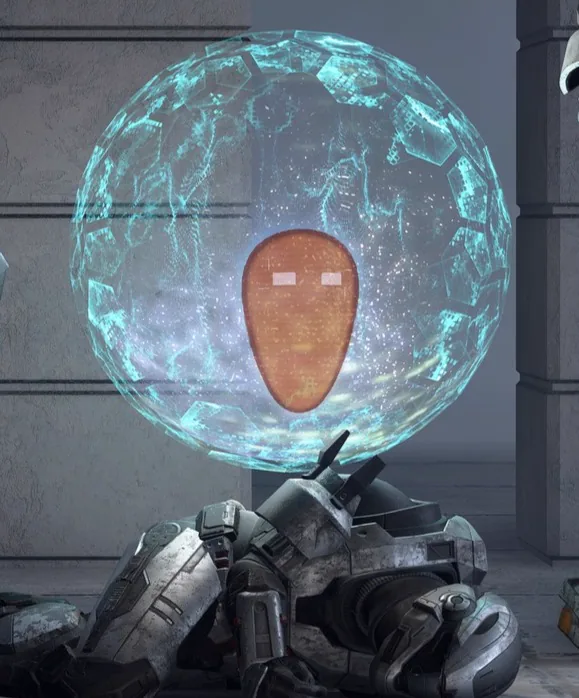

# Is it possible to set/change Attrition death orb location?

<figure><figcaption></figcaption></figure>

In Attrition mode, certain map layouts—such as those with deep drops or kill barriers—can cause death orbs to spawn in locations that are inaccessible to teammates attempting a revive. This can make the revival process difficult or impossible.

## Scripting Limitations

While Attrition death orbs are physics-enabled objects, direct manipulation of their position through scripting has proven difficult.

### Node Behavior and Targeting

Attempts to relocate orbs using the [On Revive Orb Spawned](../nodes/events-modes/on-revive-orb-spawned.md) node have yielded inconsistent results. It has been observed that the "Orb" pin provided by this node may reference the interaction button/prompt rather than the physical orb itself. In such cases, scripting movement may successfully move the interaction prompt but fail to move the visual or physical orb.

Even when attempting to target the orb more precisely—for example, by using the `Get All Objects With Spawn Order (0)` node and comparing objects—direct position adjustment has not been reliably successful.


Moving the object referenced by the `On Revive Orb Spawned` node may only move the interaction prompt rather than the physical orb.


<figure><figcaption>
An Attrition death orb is visible near a player on the ground.
</figcaption></figure>

## Alternative Approaches

Although direct teleportation is limited, other methods can be used to influence the orb's position or detection.

### Using Physics and Velocity

Because the orbs are physics objects, they respond to collisions and velocity changes. It is possible to script velocity to move the orbs, such as creating an equipment piece that pulls teammate orbs toward a player.

### Detection via Area Monitor

An alternative way to detect orbs is through an [Area Monitor](../nodes/variables-basic/area-monitor.md) using the `On Object Entered` event.

* To differentiate orbs from other objects, players can filter by team, as the revive orb shares the same team as the player it belongs to.
* When filtering, note that other objects such as vehicles also share a team with their occupants, so additional filtering may be necessary to isolate the orb.

***

## Source Data

* Discord thread: [Is it possible to set/change Attrition death orb location?](https://discord.com/channels/220766496635224065/1499877268150026342/1499877268150026342)

#### <mark style="color:green;">Contributors</mark>

seanonix\
Okom\
Artifice