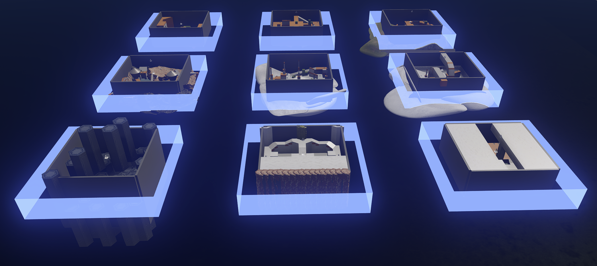
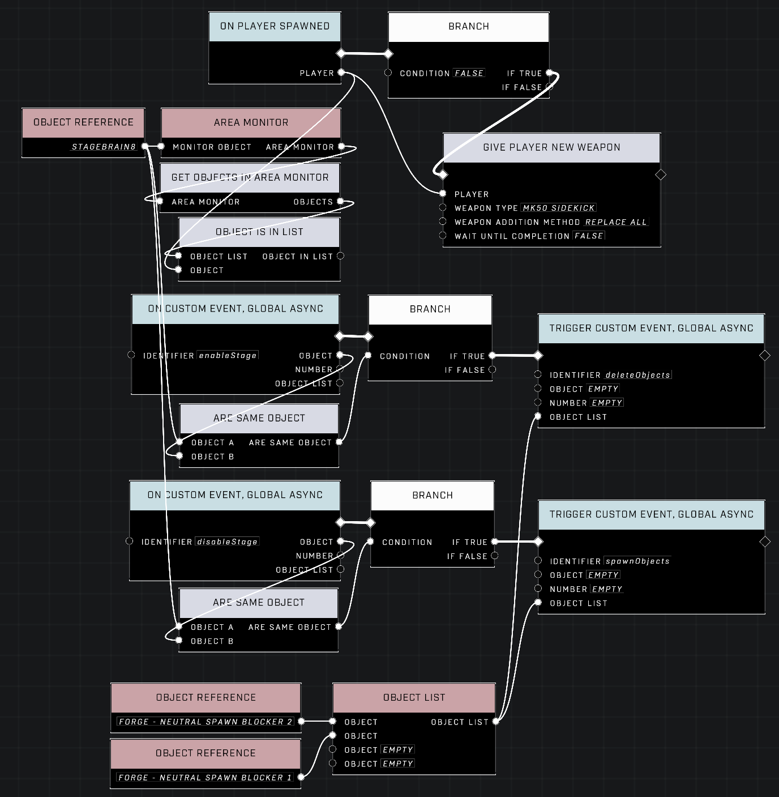
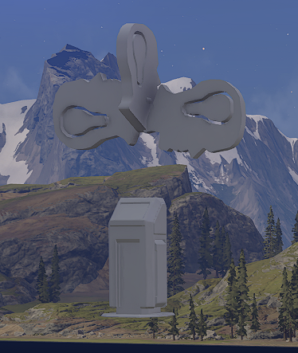
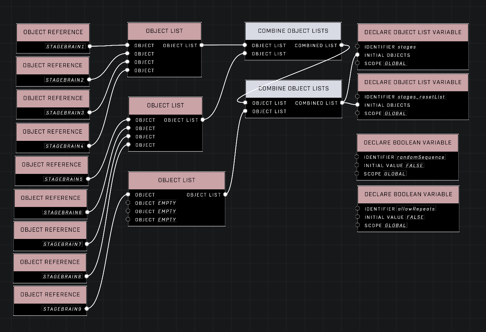
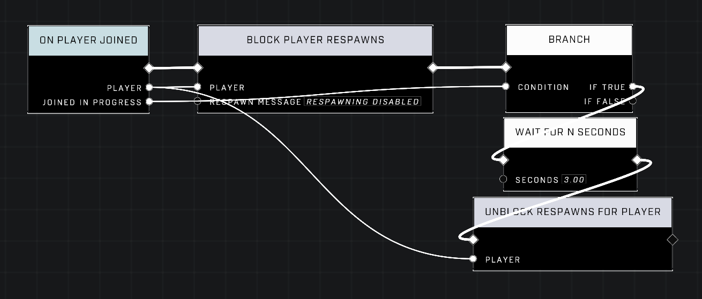
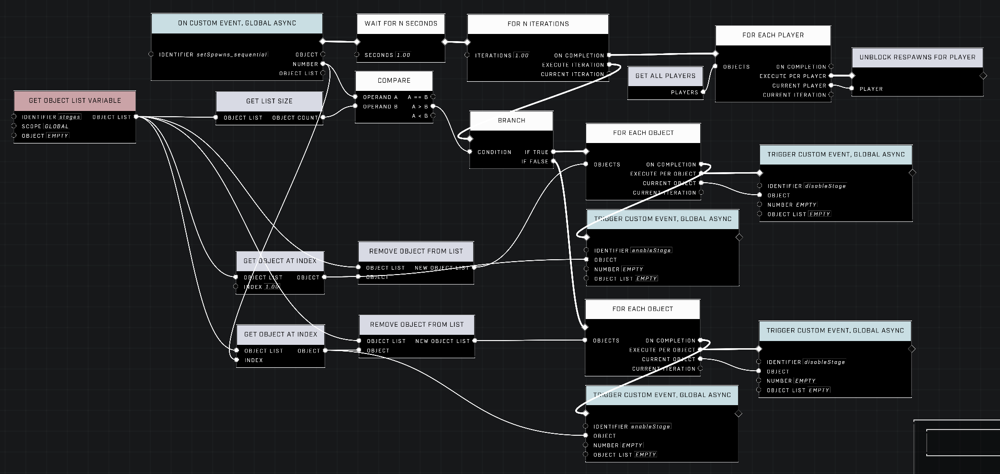

# Slipspace Arena

## Overview

Slipspace Arena was originally designed for Halo 5, with the original iteration being called Fury and having been concepted by Nitro and built out by him and other members of the Forge team Creative Force.&#x20;


Original iteration's showcase video by ForgeLabs.


### Links

[Template](https://www.halowaypoint.com/halo-infinite/ugc/maps/742ed0ca-4c61-4bc2-82fb-65dab77301ec)

[Levels](https://www.halowaypoint.com/halo-infinite/ugc/browse?page=1\&tags=tsg-slipspace-arena)

Game Modes:\
[Slipspace Arena PVP](https://www.halowaypoint.com/halo-infinite/ugc/modes/6460926b-cc23-4c6d-b5bb-b6073e067640)\
Slipspace Arena PVE _(releasing when the PVE example level is complete)_

### Gameplay

* Players spawn in a different arena per round.
* Rounds are short so that many arenas are played in a single match.
* This can be used for PVP and PVE designs.
* This was originally concepted for 1v1 and 2v2 PVP gameplay in Halo 5.
* Each arena can be set up with different gameplay options, such as modifying player loadouts and traits per arena, or going as far as to have objective modes or PVE experiences with multiple phases built in each arena, or even further and mixing PVP and PVE experiences on the same level in separate arenas.
* The default PVP experience is 2 minute rounds, first to 15 kills per round.
  * It is _intended_ that each round goes all the way to the clock running out rather than ending early from score-based win conditions _in Slayer experiences_.

<figure><figcaption>
A birds-eye-view of an early version of Seasons | Slipspace Arena, by Okom1 and MikRips
</figcaption></figure>

### Template

* 9 arenas
* Each arena has it's own spawn regions and script brain boundary set up already.
  * Each arena has a script brain (with a boundary) and 2 spawn regions.
  * The boundaries of these 3 objects must cover the entire area of the playable space in that arena.
* Each arena has spawns for Teams or FFA (4 player) play set up already.

Note: _While the primary design is for 1v1/2v2 and 4 player FFA matches, these arenas could easily be made larger and have more spawns added. For instance, this can be used to build PVE or PVPVE arenas instead; a "boss fight" per arena to create a boss rush mode would be easy to accomplish by adding code to the script brain for each area to define those encounters._

<figure><figcaption>
A top-down view of the template file.
</figcaption></figure>

### Per-Arena Logic

* On Player Spawned
  * An event stub for applying code to players that spawn in the arena this brain's code is for.
  * This is effectively an example of how to add arena-specific events.
  * By default, the Branch in this circuit is set to FALSE.
    * DO NOT set it to TRUE, or this will trigger regardless of where they spawn
    * To activate, connect the unused output of Object Is In Area to the Condition pin of the Branch node and it will only affect players that spawn inside this brain's boundary.
* Enable/Disable Stage Custom Events
  * These are called by the Central Logic brain
  * All they do is check to see if the brain selected by the Central Logic is the brain the code is on, then spawn or despawn the spawn region objects for the relevant arena.
  * These should not be edited.

<figure><figcaption>
Circuits that use the current Stage Brain's Object Reference for context.
</figcaption></figure>

### Central Logic

<figure><figcaption></figcaption></figure>

* The Central Logic is in an arrangement of Script Brains above an Invisible Switch.
* Includes a version of [tsg init](tsg-init.md).

#### Variable Declarations

* Object List Declarations for `stages` and `stages_resetList`
  * The order only matters if you aren't using the random sequence.
  * This only needs edited if you are:
    * Changing the order of stages when not using the random sequence
    * Adding or removing stages
  * `stages_resetList` is used to reset `stages` when `stages` becomes empty.&#x20;
* Boolean Declarations for `randomSequence` and `allowRepeats`
  * Control if the sequence is random and if it can repeat arenas before having gone through each one be setting the initial values of these declarations to the relevant TRUE/FALSE values for your needs.

<figure><figcaption>
The list of all of the Stage Brains, as well as declarations for controlling the sequence of arenas between rounds.
</figcaption></figure>

#### On Player Joined

* This is here to prevent players from attempting to spawn before there are available spawn points at the beginning of a match, which would spawn them at the level's backup spawn points instead of inside the current arena.

<figure><figcaption></figcaption></figure>

#### On Round Start

* This is the first half of the logic that picks which stage to activate.
* Each round, all of the arenas are deactivated and a single arena is selected to be reactivated for that round.

<figure><figcaption></figcaption></figure>

`setSpawns_sequential` and `setSpawns_random`

* The second half of the logic that sets the active stage
* Sequential

<figure><figcaption>
A circuit that increments the stage each round, rolling back to stage 1 when it reaches the end of the list.
</figcaption></figure>

* Random
  * So that no stage is picked twice when random order is enabled, stage brains are removed from the list when their arena becomes active.
  * When `stages` is empty, a second list that has its original objects is used to refill it so that the sequence can start over.

<figure><figcaption>
A circuit that picks a random Stage Brain from <code>stages</code> to activate and remove from the list, resetting the list when it's empty.
</figcaption></figure>

## Contributors

Captain Punch\
Okom\
MikRips
