# tsg init

## Current file

[tsg init v3](https://www.halowaypoint.com/halo-infinite/ugc/prefabs/0bc158a8-83b4-4915-a50e-7478f4632120)\
\*Note: Identifier node notation in screenshots was not able to be saved in prefab.\*

### Game Event Handler

* Provides separated events for universal and Forge-only code at game events to facilitate initialization
  * In this context 'universal' means it fires in Forge _and_ Customs, regardless of game mode.
* Provides Game, Round, and Gameplay events that occur in fixed order
  * Issues Solved:
    * Game/Round Start firing in same tick universally
    * Game/Round/Gameplay Start firing in the same tick in Forge
  * This separates each with at least 1 second in both Customs and Forge to ensure timings happen as expected.
* The Forge-only code can be easily stripped out of projects when it is no longer needed.

<figure>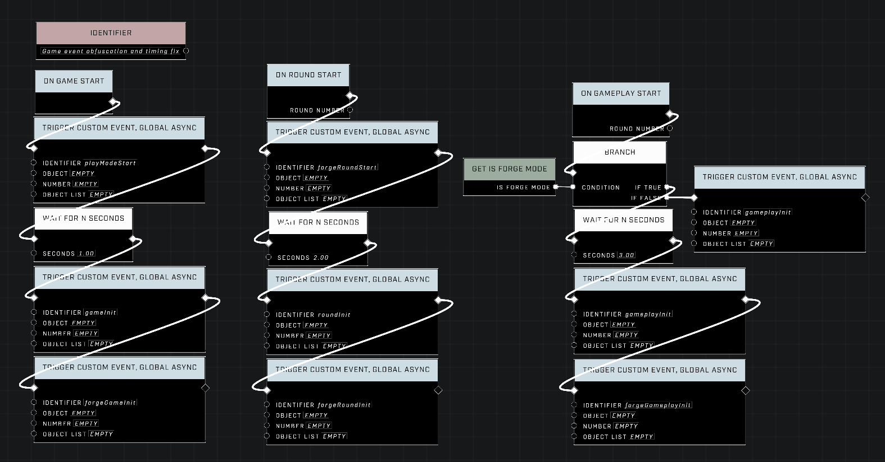<figcaption></figcaption></figure>

#### Game Start

_Anything that needs to happen universally during the first server tick would be done using the raw On Game Start event._

* `playModeStart`
  * Things that need to happen to simulate Customs behavior for Game Start when Play Mode is started in Forge use this event.
* Wait 1 Second
  * Things that can't process in the first server tick generally need at least a 0.1 second wait after Game Start to not fail.
  * 1 second is the default. Feel free to adjust it down. I would not adjust it up.
* `gameInit`
  * Things that need to happen universally for game initialization, but not in first server tick, use this event.
* `forgeGameInit`
* Things that need to happen to simulate Customs behavior in Forge for game initialization, but not in first server tick, use this event.

#### Round Start

_Anything that needs to happen universally during the first server tick each round would be done using the raw On Round Start event._

* `forgeRoundStart`
  * Things that need to happen to simulate Customs behavior for when Rounds start in Forge use this event.
* Wait 2 Seconds
  * Things that can't process in the first server tick generally need at least a 0.1 second wait after Game Start to not fail.
  * 2 seconds is the default. Feel free to adjust it down. I would not adjust it up.
  * This needs to be longer than the wait in the Game Start event.
* `roundInit`
* `forgeRoundInit`

#### Gameplay Start

_The raw Gameplay Start event is deprecated by these outputs._

* Branch, Is Forge Mode: True
  * Wait 3 Seconds
    * 3 seconds is the default. Feel free to adjust it down. I would not adjust it up.
    * This needs to be longer than the wait in the Round Start event.
  * `gameplayInit`
    * Things that need to happen universally at Gameplay Start use this event.
    * This is the copy that fires in Forge.
  * `forgeGameplayInit`
    * Things that need to happen to simulate Customs behavior for Gameplay Start in Forge use this event.
* Branch, Is Forge Mode: False
  * `gameplayInit`
    * Things that need to happen universally at Gameplay Start use this event.
    * This is the copy that fires in Customs.

### Initialization

<figure>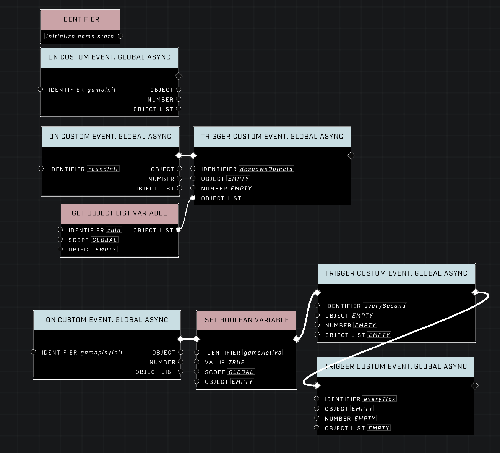<figcaption></figcaption></figure>

#### `gameInit`

* Fires 1 Second after Game Start

#### `roundInit`

* Fires 2 Seconds after Round Start
* Objects with Label: \`Zulu\` are deleted to work around not having a toggle for 'spawn at start'.

#### `gameplayInit`

* Fires 3 Seconds after Gameplay Start in Forge and at Gameplay Start in Customs
* Sets `gameActive` to `TRUE` and triggers recursive timers

### Forge Initialization

<figure>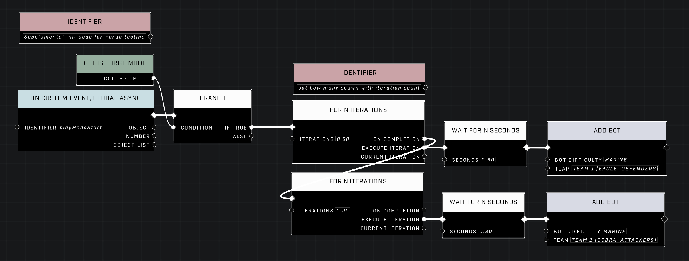<figcaption></figcaption></figure>

<figure>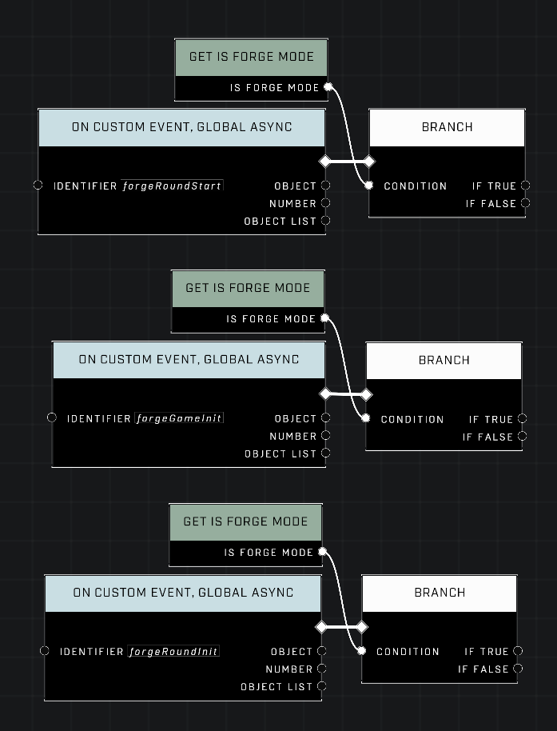<figcaption></figcaption></figure>

#### `playModeStart`

* Fires when entering Play Mode
* Has pre-coded bot init, just need to adjust iteration counts to activate/tune

#### `forgeGameInit`

* Fires 1 Second after Game Start in Forge

#### `forgeRoundInit`

* Fires 2 Seconds after Round Start in Forge

#### `forgeGameplayInit`

* Fires 3 Seconds after Gameplay Start in Forge

### Multi-Round Handler

_Turns off `gameActive` and triggers `resetVars` at Round End_

<figure>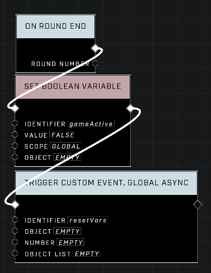<figcaption></figcaption></figure>

<figure>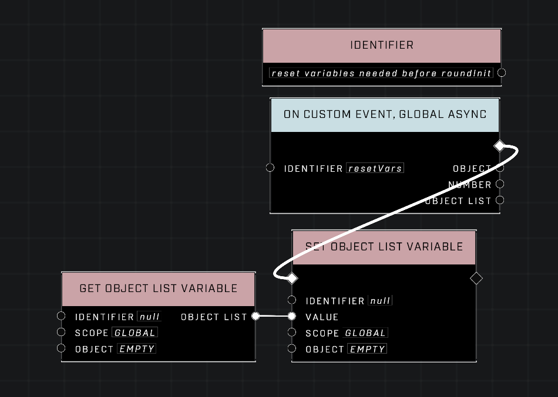<figcaption></figcaption></figure>

#### Round End

* Set `gameActive` (Bool, Global) to `FALSE`
  * This boolean variable is used to prevent execution before `gameplayInit` and after Round End.
  * It is set to `TRUE` at `gameplayInit`.
* `resetVars`
  * This event is the appropriate place to do all of your variable resetting for multi-round modes.

#### `resetVars`

* Fires at Round End for the resetting of advanced variables that shouldn't carry their values over to the next round.

### Recursive Timers

\*Regular timers can break and don't behave well across rounds. Because they could break, custom events were the workaround. Because they didn't handle well across rounds, this pattern was introduced.\*

<figure>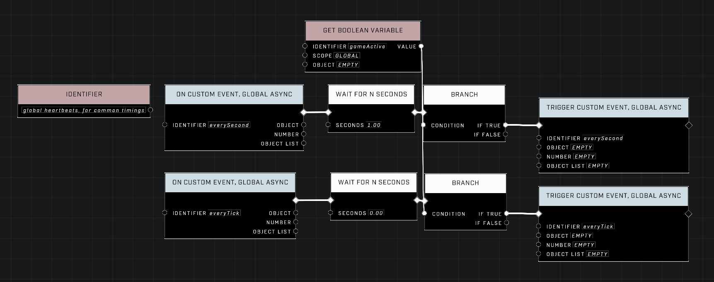<figcaption></figcaption></figure>

#### `everyTick`

* Wait for 0 Seconds
* Branch, is `gameActive`: True
  * `everyTick`

#### `everySecond`

* Wait for 1 Seconds
* Branch, is `gameActive`: True
  * `everySecond`

### Player State Control Traits

\*Traits to prevent attacking/damage, make players invincibile, and control weapon/grenade/equipment pick up in an a la carte fashion, which is sometimes necessary.\*\
\
If you want to grant a weapon to a player who has pick up disabled, you have to temporarily remove it; to do this without removing other attached traits, it must be by itself like below. This logic is why the others are also segmented the way they are.\*

<figure>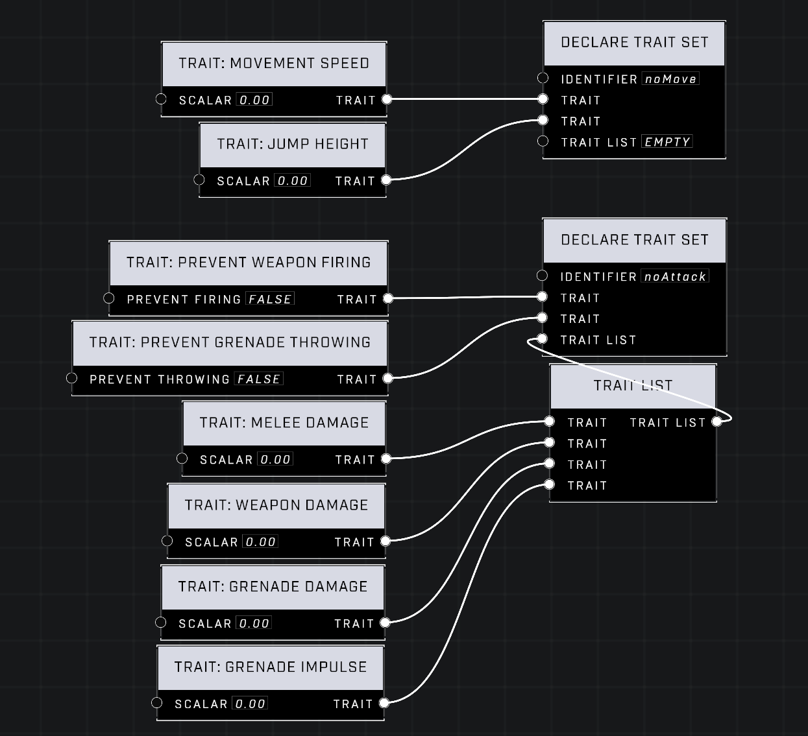<figcaption></figcaption></figure>

<figure>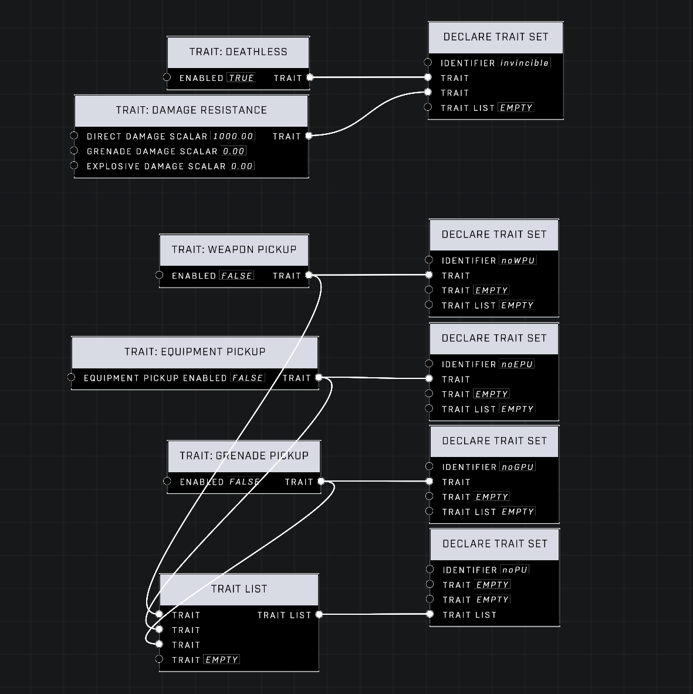<figcaption></figcaption></figure>

### Player Event Starter Kit

\*A collection of player events and helpful code snippets for working with them for setting up modes and for debug.\*

<figure>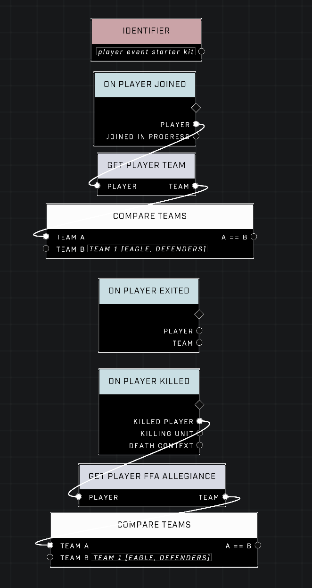<figcaption></figcaption></figure>

<figure>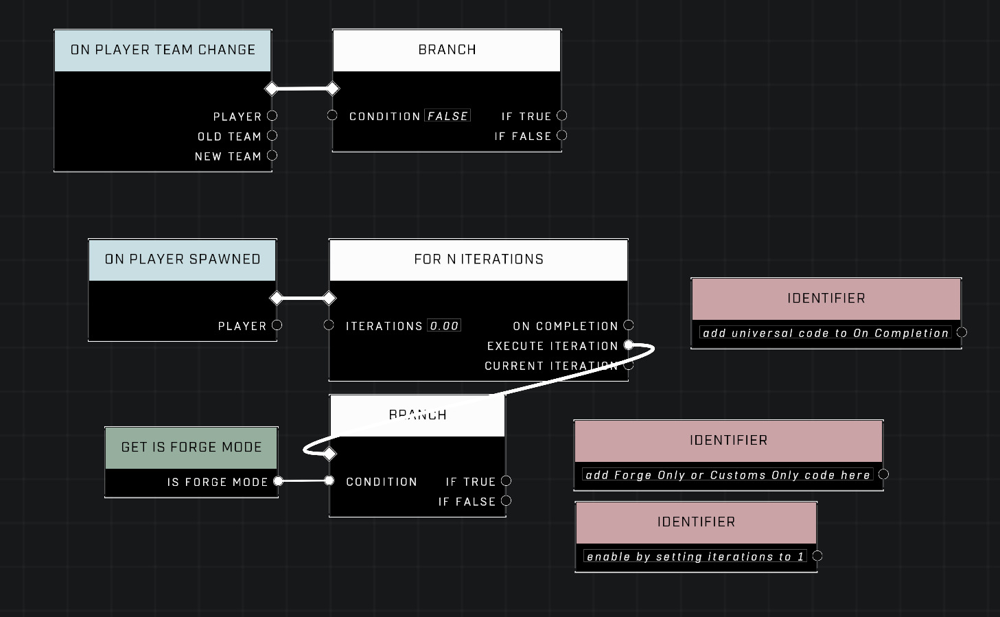<figcaption></figcaption></figure>

<figure>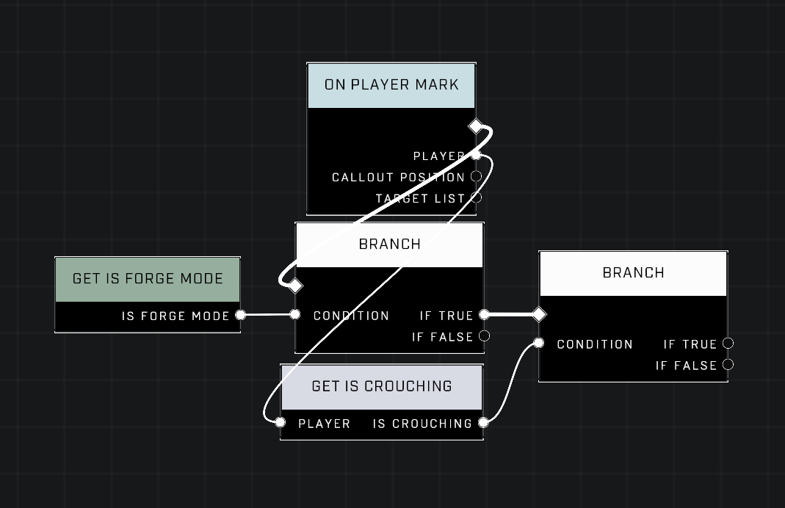<figcaption></figcaption></figure>

### Switch and Area Monitor Code Snippets

\*Snippets/examples of how to handle switches/area monitors.\*

The custom events allow for the centralization of outputs. Multiple switches triggering custom events with the same identifier will all cause the On Custom Event node for that identifier to execute. This pattern holds true for other similar events, like On Object Damaged, etc. \
\
Copy these snippets to save having to place and connect all of those nodes each time you set one of these up. Remove the custom events if not needed to reduce bloat.

<figure>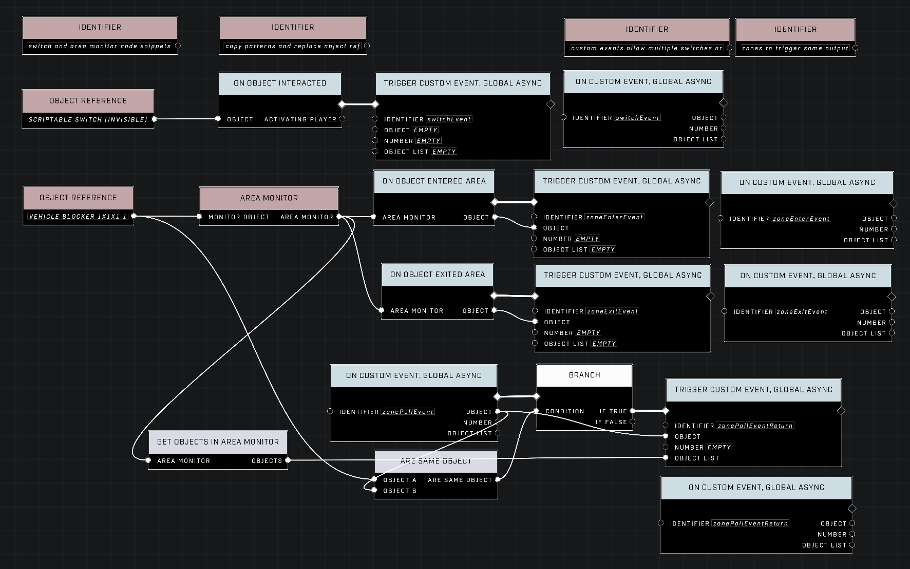<figcaption></figcaption></figure>

### Object List Templates/Variable Starter Kit/`null` Var Kit

\*Defining the `zulu` list for deletion at `roundInit`, a snippet for manually defining an Object List, and `null` variables for turning into real variables.\*

<figure>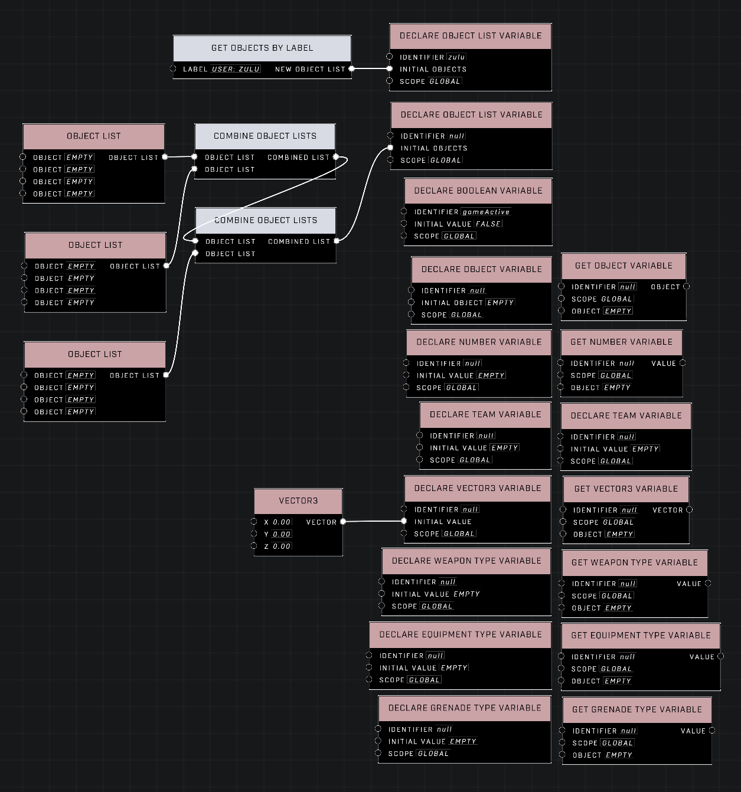<figcaption></figcaption></figure>

### Code Duplication Mitigation

\*Some operations that get re-used, even short ones, benefit from being functionalized so that code is smaller. In this instance, any For Each with even a single node is more efficient functionalized than it is duplicated wherever it's needed as soon as you've needed it 4 times. This increases with the introduction of needing to add delays, etc. Because of this, these examples for spawning, despawning, resetting, and translating objects on singles axes, were added.\*

<figure>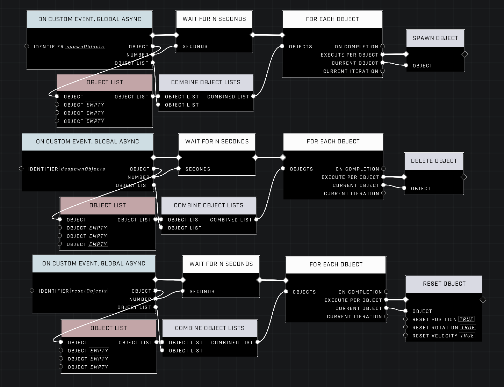<figcaption></figcaption></figure>

<figure><figcaption></figcaption></figure>

<figure>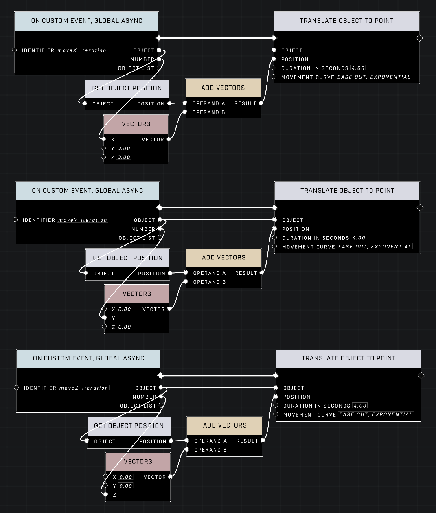<figcaption></figcaption></figure>

#### `spawnObjects`

#### `despawnObjects`

#### `resetObjects`

#### `moveX`

* `moveX_iteration`

#### `moveY`

* `moveY_iteration`

#### `moveZ`

* `moveZ_iteration`

### `doNothing` Custom Events and `null` Identifier

\*Sometimes you need to disable a custom event trigger or listener without deleting it or changing other code. The best way to solve this is to rename it to an identifier that isn't ever triggered or whose listener has no code attached.\*

<figure>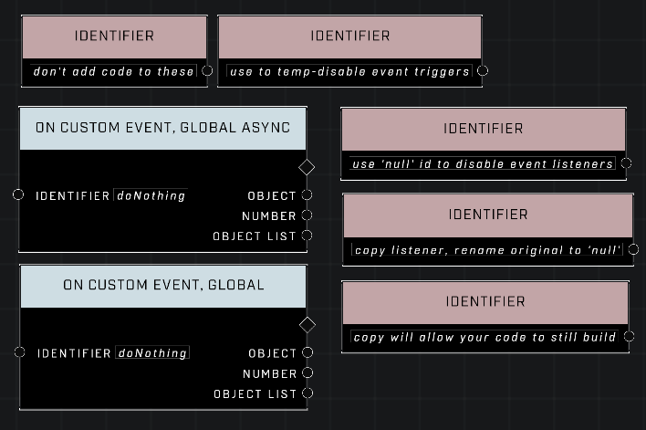<figcaption></figcaption></figure>

#### `doNothing`

* Set custom event triggers to this ID to disable them.
* These events being present will allow the node graph to still build fully.

#### `null`

* Set custom event listeners (On Custom Event) to this ID to disable them.
* Make a copy of the original next to itself with the original ID first so that the node graph will still build.

### Debug Starter Kit

\*Copy nodes from this snippet to quickly set up debug when needed.\*

<figure>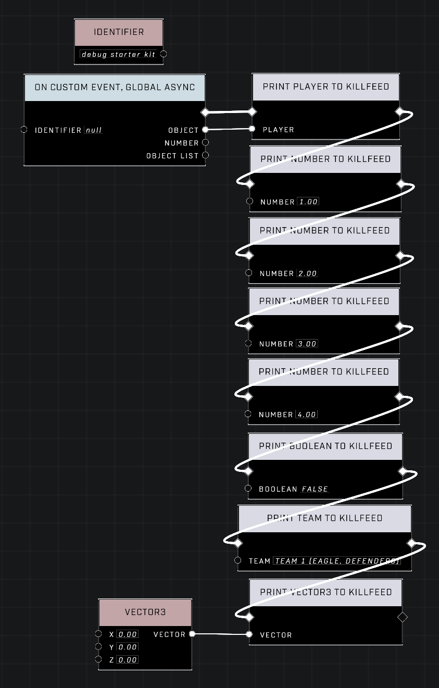<figcaption></figcaption></figure>

## Contributors

Captain Punch
